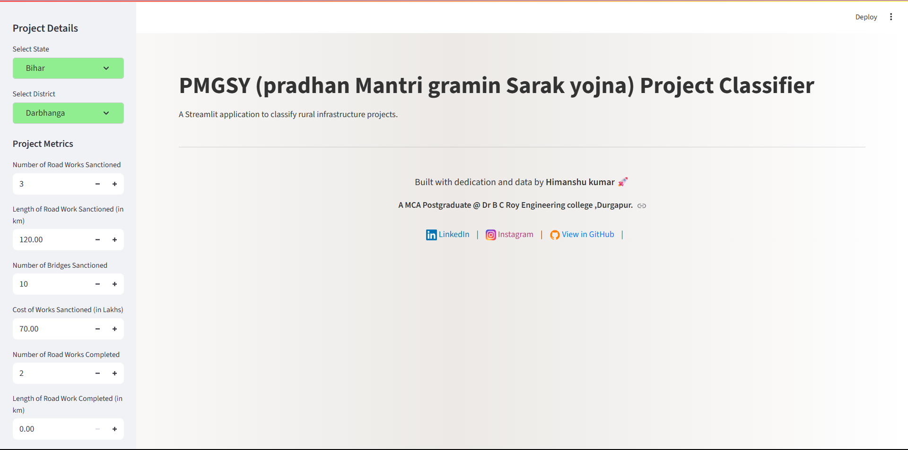

# AI-Powered PMGSY Project Classifier 🛣️

This repository contains the code for an intelligent web application that classifies Pradhan Mantri Gram Sadak Yojana (PMGSY) projects. The project leverages **IBM Watsonx.ai** for automated machine learning and **Streamlit** for the interactive user interface.

[](https://pmsgy-classification-project-using-ibm-cloud-services.streamlit.app/)




---

## 📋 Project Workflow

This project was developed following a modern, end-to-end machine learning workflow:

1.  **Model Creation in IBM Watsonx.ai Studio**:
    * A new project was initiated within the IBM Cloud's Watsonx.ai Studio.
    * The **AutoAI** functionality was used to build a machine learning model automatically.
    * The project's dataset (`Intelligent Classification of Rural Infrastructure Projects.csv`) was uploaded.
    * AutoAI then preprocessed the data and evaluated multiple machine learning algorithms to find the best-performing model pipeline.

2.  **Model Deployment**:
    * The pipeline that demonstrated the highest accuracy was selected and saved as a new model.
    * This model was then deployed within the Watsonx.ai environment, which generated a unique **public API endpoint** and an **API key** for programmatic access.

3.  **Web Application Development**:
    * A web user interface was built using **Python** and the **Streamlit** library, contained in the `app.py` script.
    * The application uses the `requests` library to communicate with the deployed model's API endpoint.
    * It first authenticates with the IBM Cloud by passing the API key to obtain a temporary **IAM access token**.
    * User inputs from the web UI are then sent to the API endpoint along with the IAM token to get a live prediction.
    * Finally, the prediction and confidence score are displayed back to the user in a clean, interactive interface.

---

## 🛠️ Technology Stack

* **Machine Learning**: **IBM Watsonx.ai** (specifically the AutoAI feature)
* **Cloud & Deployment**: **IBM Cloud**
* **Web Framework**: **Streamlit**
* **Backend Language**: **Python**
* **Data Handling**: **Pandas**
* **API Communication**: **Requests**

---

## 🚀 Features

* **Automated Model Building**: Leverages IBM's AutoAI to ensure the most effective model is used.
* **Real-Time Predictions**: Directly interacts with a deployed cloud model for live classification.
* **Interactive UI**: A user-friendly interface for easy data entry and clear result visualization.
* **Secure API Calls**: Implements IAM token-based authentication for secure communication with the IBM Cloud.
* **Detailed Input**: Allows for comprehensive data input across sanctioned, completed, and balance works.

---

## ⚙️ Setup and Local Installation

To run this project on your local machine, follow these steps:

1.  **Clone the repository:**
    ```bash
    git clone [https://github.com/your-username/your-repository-name.git](https://github.com/your-username/your-repository-name.git)
    cd your-repository-name
    ```

2.  **Create and activate a virtual environment:**
    ```bash
    # For Windows
    python -m venv venv
    .\venv\Scripts\activate

    # For macOS/Linux
    python3 -m venv venv
    source venv/bin/activate
    ```

3.  **Install the required dependencies:**
    Create a `requirements.txt` file with the content below and run the installation command.

    **`requirements.txt`:**
    ```
    streamlit
    pandas
    requests
    ```

    **Installation command:**
    ```bash
    pip install -r requirements.txt
    ```

4.  **Configure API Credentials:**
    Open the `app.py` script and replace the placeholder values with your actual **IBM Cloud API key** and **Deployment Endpoint**.
    ```python
    API_KEY = "YOUR_API_KEY"
    DEPLOYMENT_URL = "YOUR_PUBLIC_ENDPOINT_URL"
    ```

5.  **Run the Streamlit app:**
    ```bash
   python -m streamlit run app.py
    ```
    The application will open in a new tab in your web browser.

6. **Local Host server:**

    Local URL: http://localhost:8501
    Network URL: http://192.168.31.210:8501
---

## 👨‍💻 About the Author

**Himanshu kumar**  
MCA Postgraduate @ Dr B C Roy Engineering college ,Durgapur  

- 🔗 [LinkedIn](www.linkedin.com/in/himanshu-kumar-4214b722b)  
- 📸 [Instagram](https://www.instagram.com/himanshukashyap_20?igsh=MW0zYjNwNnBwcWN6OQ==)
- 🌐 [Git Hub link](https://github.com/kashypHi/PMSGY-Classification-Project-using-IBM-Cloud-Services.git)

> Passionate about UI Interfece in Frontend,,AI, Data Science, and building intelligent applications that make an impact.

